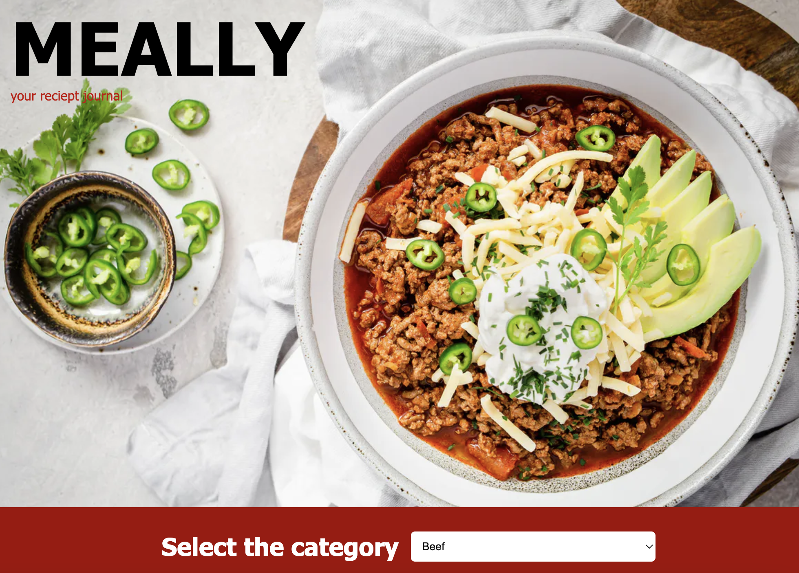

# Meally - Your reciept jornal

## This is an meal reciept app, where you can get meals reciept considering of the Area, Category and main ingrediente.

### In this project I used React JS with hooks:
- `useState()`
- `useEffect()`
- `useSelector()`
- `useDispatch()`

# The [Demo Live](https://joyful-semifreddo-58d82c.netlify.app/) version is available

## Project status: on going

### Built with

- React JS
- React Bootstrap
- Netlify

### Run project on local machine

- copy and run this command to your terminal `git clone https://github.com/elmar8287/meally.git`
- switch to right directory by `cd meally`
- instal npm by running this command `npm i`
- start the project by running this command `npm start`

## Author

- GitHub: [@elmar8287](https://github.com/elmar8287)
- LinkedIn: [Elmar Abdulkarimov](https://www.linkedin.com/in/elmar.abdulkarimov/)

## 🤝 Contributing

Contributions, issues, and feature requests are welcome!

Feel free to check the [issues page](https://github.com/elmar8287/meally/issues).

## Show your support

Give a ⭐️ if you like this project!

License could be find [here](https://github.com/elmar8287/meally/blob/dev/LICENSE)
